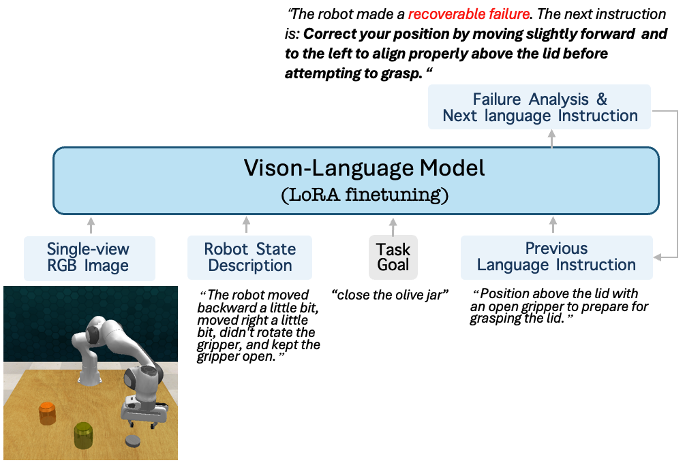

# RACER LLaVA Code

This code is adapted from [Open-LLaVA-NeXT](https://github.com/xiaoachen98/Open-LLaVA-NeXT). Thanks for their wonderful training code!


## ⚙️ Model
<div style="text-align: center;">
  
</div>


## 🔧 Usage

### 1. Clone this repository
```bash
git clone https://github.com/rich-language-failure-recovery/Open-LLaVA-NeXT
cd Open-LLaVA-NeXT
git pull
git checkout racer_llava
```

### 2. Install Package
```Shell
conda create -n llava-next python=3.10 -y
conda activate llava-next
pip install --upgrade pip  # enable PEP 660 support
pip install -e .
pip install -e ".[train]"
pip install flash-attn --no-build-isolation
```

For more information, please refer to [Open-LLaVA-NeXT](https://github.com/xiaoachen98/Open-LLaVA-NeXT).

### 4. Training (Optional)  

#### Prepare data
Build a symbolic link of the our `augmented_rlbench` data, put it under the main directory
```
cd Open-LLaVA-NeXT
ln -s <real_path_of_downloaded_augmented_rlbench> augmented_rlbench
```

Then gather all llava training data into one file for training
```
cd Open-LLaVA-NeXT
mkdir playground
python gather_racer_llava_data.py
```

#### Modle training 
Download [llama3-llava-next-8b](https://huggingface.co/lmms-lab/llama3-llava-next-8b). We use LoRa tuning, trained on either a local machine or with slurm.
```
./scripts/finetune_task_lora_local_mytrain.sh
./scripts/finetune_task_lora_slurm_mytrain.sh
```

### 5. Set up online service

#### 5.1. Set up language encoder service (i.e., CLIP and T5 model) (Around 20GB in total)
Download [T5-11b](https://huggingface.co/google-t5/t5-11b). Change the `MAIN_DIR` path in ` deploy/lm_server.py ` and run it. The [CLIP](https://github.com/openai/CLIP) model will be downloaded automatically.

```
CUDA_VISIBLE_DEVICES=0 python deploy/lm_server.py 
```

When the server is running, you should get some messages like this
```
INFO:     Started server process [2133695]
INFO:     Waiting for application startup.
INFO:     Application startup complete.
INFO:     Uvicorn running on http://0.0.0.0:8000 (Press CTRL+C to quit)
```

#### 5.2 Set up LLaVA service (Around 18GB initally, peak memory around 30GB)
You can either trained on your own or downloader our trained racer-llava lora checkpoints([racer-llava-rich](https://huggingface.co/Yinpei/racer-llava-llama3-lora-rich) trained with rich instructions and [racer-llava-simple](https://huggingface.co/Yinpei/racer-llava-llama3-lora-simple) trained with simple instructions), and place it under the `checkpoints` directory.
```
CUDA_VISIBLE_DEVICES=1 python deploy/llava_server.py --model-path <path-to-downloaded-racer-llava-lora-checkpoint> --model-base <path-to-downloaded-llama3-llava-next-8b>  --model-name llava_llama3_lora
```
When the server is running, you should get some messages like this

```
Loading checkpoint shards: 100%|████████████████████████████████████████████████████████████████████████████████████| 4/4 [01:52<00:00, 28.24s/it]
Loading additional LLaVA weights...
Loading LoRA weights...
Merging LoRA weights...
Model is loaded...
INFO:     Started server process [2140134]
INFO:     Waiting for application startup.
INFO:     Application startup complete.
INFO:     Uvicorn running on http://0.0.0.0:21002 (Press CTRL+C to quit)
```
